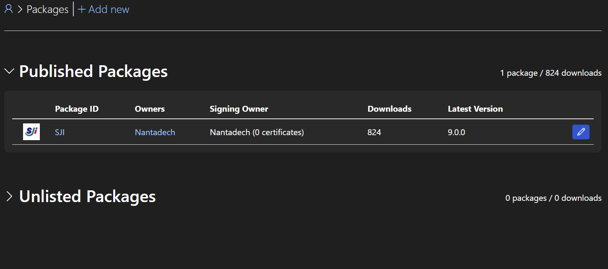
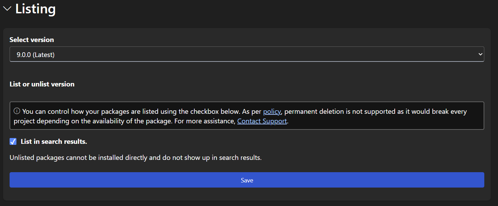
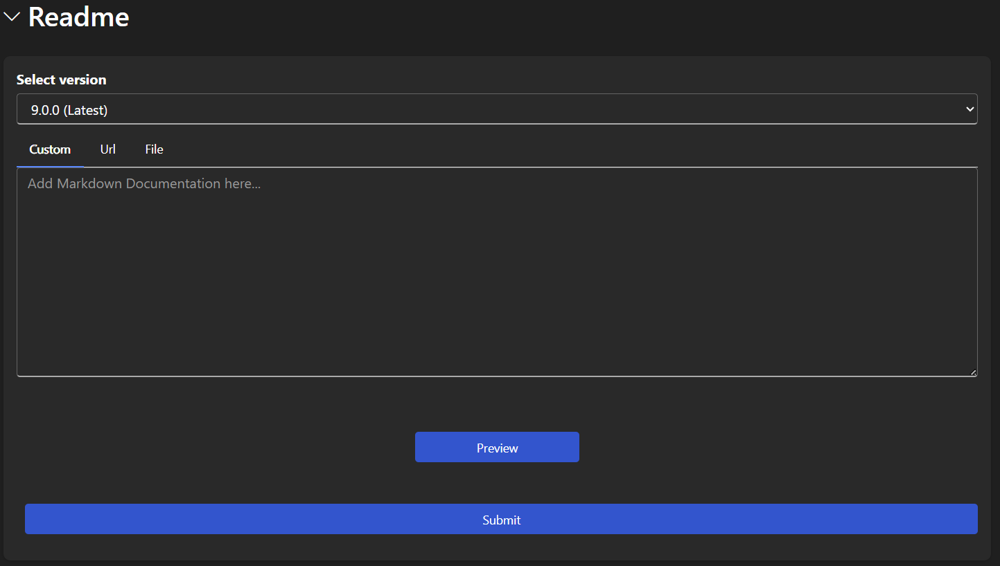

# Developing the SJI Nuget Package

## Installation

1. **Clone the repository:** `git clone https://github.com/mr-nantadech/sji-nuget.git`
2. **Checkout a new branch from master:** `git checkout -b <your-branch-name>`
3. **Edit the package code:** The main package file is `SJIExtensions.cs`.

## Contributing Changes

1. **Commit your changes:** Use `git commit -m "Your descriptive commit message"`.
2. **Push your branch:** `git push --set-upstream origin <your-branch-name>` to push your changes to the remote repository.

## Releasing a New Version (Tagged Release)

1. **View existing tags:** `git tag`
2. **Create a new tag (incrementing from the last version):** `git tag 1.0.x` (replace `1.0.x` with the correct version number)
3. **Push the new tag:** `git push origin 1.0.x`

## Publishing to Nuget Package Store

1. **Update the package version:**  Modify the `<Version>` tag in the `SJI.csproj` file to reflect the new version (incrementing from the last version):
   ```xml
   <PropertyGroup>
     ...
     <Version>x.x.x</Version>  <!-- Replace x.x.x with the new version -->
     ...
   </PropertyGroup>
2. **Build the library package:** Run `dotnet pack --configuration Release` to build the package. This will create the `SJI.<version>.nupkg` file in `\SJI\bin\Release`.
3. **Push the file to the NuGet store:** Run `dotnet nuget push .\bin\Release\SJI.<version>.nupkg --api-key <your-api-key> --source https://api.nuget.org/v3/index.json`.
4. **Set Up Version to Publish on NuGet**

   - Go to [NuGet Packages](https://www.nuget.org/account/Packages).
   - Click on **Published Packages** to view your list of published packages.

     

   - Click the pencil icon on the far right for the **SJI** Package ID.
   - In the **Listing** section, select the latest version and click **Save**.

     

   - **Optional:** To update version details, scroll down to the **Readme** section under **Listing**.
   
     


**Important:** Replace `<your-api-key>` with your actual NuGet API key and `<version>` with the correct version number. 


## Using the Library via NuGet

This SJI Package requires .NET 7.0 or later.
You can install it directly from Visual Studio's NuGet Package Manager or via the command line:

`Install-Package SJI -Version <version>`

You can also find it on the NuGet website:

[https://www.nuget.org/packages/SJI](https://www.nuget.org/packages/SJI)
